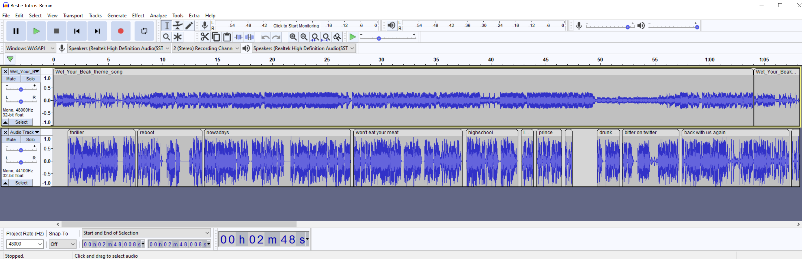

# Bestie Intros by Jason Calacanis

This project is meant to be a tribute to the All-In Podcast (https://www.youtube.com/channel/UCESLZhusAkFfsNsApnjF_Cg/videos). I was thorougly enjoying Jason's phenomenal stamina and creativity with the recent "Bestie Intros" theme and I thought, wouldn't it be great to create a remix. This is my attempt. Below I share my process in hopes of community feedback and follow up remixes, hopefully of more professional grade quality ;).

I used Audacity (aup3 file extension). The first track is the "Wet Your Beak" theme song. The second track is clips from recent episodes. In the [all_in_podcast_bestie_intros](all_in_podcast_bestie_intros) folder, I have separated out the "Bestie Intros" for each episode in their own folder. I then further separated out the Intros for each Bestie. I also dictated the Intros for each episode the best I could in the [all_in_podcast_bestie_intros/README.md](all_in_podcast_bestie_intros/README.md). I then pieced  together the clips into the second track as can be seen below.

Here you can listen to my work in progress:
https://bit.ly/3sKXeCV